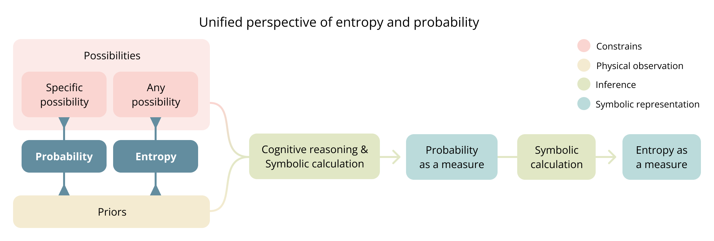
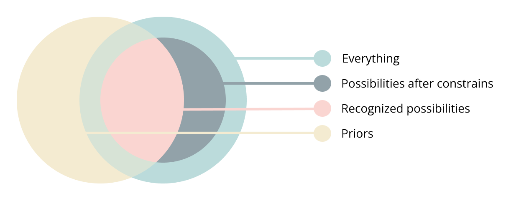

## Table of contents

- [A unified perspective of entropy and probability](#a-unified-perspective-of-entropy-and-probability)
  - [Phenomenon and measure are distinct](#phenomenon-and-measure-are-distinct)
  - [Phenomena](#phenomena)
    - [Entropy and probability as phenomena](#entropy-and-probability-as-phenomena)
    - [Mapping to intuitive understanding](#mapping-to-intuitive-understanding)
    - [What are priors](#what-are-priors)
    - [What are possibilities](#what-are-possibilities)
      - [Constraints define and unify possibility spaces](#constraints-define-and-unify-possibility-spaces)
      - [Specificity as constraint](#specificity-as-constraint)
      - [Only constraints recognized by priors have an effect](#only-constraints-recognized-by-priors-have-an-effect)
    - [What is inference](#what-is-inference)
      - [Inference types as constraints](#inference-types-as-constraints)
      - [The inference process can't be separated from priors or possibilities](#the-inference-process-cant-be-separated-from-priors-or-possibilities)
  - [Measures](#measures)
    - [From phenomenon to measure](#from-phenomenon-to-measure)
    - [Priors and possibilities are constrained by foundational priors](#priors-and-possibilities-are-constrained-by-foundational-priors)
    - [Probability as measure encodes possibilities and priors](#probability-as-measure-encodes-possibilities-and-priors)
    - [Entropy as a Measure](#entropy-as-a-measure)
    - [Entropy as a measure can't be unified](#entropy-as-a-measure-cant-be-unified)
  - [Revisiting classic entropy frameworks](#revisiting-classic-entropy-frameworks)
    - [A priors taxonomy](#a-priors-taxonomy)
    - [Entropy in statistical mechanics](#entropy-in-statistical-mechanics)
      - [Entropy and the second law of thermodynamics](#entropy-and-the-second-law-of-thermodynamics)
    - [Entropy in information theory](#entropy-in-information-theory)
      - [Entropy is not relative to the observer](#entropy-is-not-relative-to-the-observer)
  - [Conclusion](#conclusion)
  - [Notes](#notes)

# A unified perspective of entropy and probability

*Entropy* is one of the most widely used and conceptually fragmented ideas in science. It appears across disciplines each offering different definitions while attempting to describe a similar underlying phenomenon. Because each field builds on its own assumptions, entropy often appears inconsistent across contexts, making its unifying principles harder to see.

The [Quanta Magazine article](https://www.quantamagazine.org/what-is-entropy-a-measure-of-just-how-little-we-really-know-20241213/) provides good background for this work. It explores this tension by tracing how entropy has evolved historically across disciplines. It highlights the conceptual ambiguity that arises when entropy is treated both as a physical property and as a measure of ignorance or uncertainty, depending on the framework.

In this work, I introduce a conceptual framework that unifies entropy and probability as *phenomena*. While the focus is on information theory and statistical mechanics, the framework is extensible to other forms of entropy. Rather than treating these interpretations as analogous, it reveals them as expressions of the same underlying structure grounded in the relationship between *priors* and *possibilities*.

The first part: **Phenomena** defines entropy and probability as relationships between *priors* and *possibilities*, and introduces the core components that shape them.

- Entropy and probability exist as phenomena before measurement. They represent relationships that exist in reality independent of our attempts to quantify them.
- As phenomena, entropy and probability describe the relationship between *priors* and *possibilities*. They differ only in specificity: *probability* concerns a specific possibility, while *entropy* concerns any possibility within the defined space of possibilities.
- *Possibilities* emerge from *constraints* imposed on an otherwise unrestricted reality. This framing unifies how possibility spaces are defined across frameworks.
- *Priors* are anything that informs. Frameworks, inference mechanisms, symbolic representations, and formulas all emerge from priors. For entropy and probability to be well defined, priors must be comprehensive.

The second part: **Measure** examines how phenomena are transformed into symbolic quantities. It shows how this process is not neutral but shaped by priors embedded in the modeling framework, representation, and inference process.

Finally: **Revisiting classic entropy frameworks** applies the lens of this framework to statistical mechanics and information theory, challenging and clarifying their interpretation of entropy

- In statistical mechanics, entropy is not an inherent property of physical systems, but a reflection of the relationship between what is known and what is considered possible, framed by its specific modeling assumptions.
- The role of entropy in the second law of thermodynamics requires reinterpretation. The idea that entropy inherently increases over time misrepresents what the law actually states. Entropy increases only within the modeling assumptions and priors used in statistical mechanics.
- Entropy is not merely observer-dependent, as suggested in information theory, but *prior*-dependent—including priors not held by any specific observer but embedded in the framework itself.
  
## Phenomenon and measure are distinct

**Phenomena** exist independently of representation. Mathematical expressions, language, visual models, and formal notations provide ways to describe them, but no symbolic representation can fully capture reality. A map is never the territory.

A mountain's height exists whether measured in feet or meter. Economic growth exists whether expressed as percentages or narrated in an article.

**Measurement** is a specific type of representation that quantifies phenomena. It transforms the phenomenon into numerical values enabling comparison and computation.

This distinction applies to probability and entropy. They exists as a phenomenon independently of any mathematical formulation used to measure it.

## Phenomena

This section explores entropy and probability as underlying phenomena before examining them as measures. It define priors and possibilities, its primary components and introduces inference as phenomenon to explain how these relationships transform into measurable quantities.

### Entropy and probability as phenomena

Entropy and probability exist as phenomena before they are formalized into measures. Both represent fundamental relationships between what is known (priors) and what is believed possible (possibilities), differing only in their specificity.

Priors reflect the entire state of knowledge or belief informing the situation, while possibilities represent the range of outcomes or configurations considered plausible within that knowledge.

> **Entropy as a phenomenon** is the relationship between **priors** and **any possibility**, relative to the entire space of **possibilities**.

> **Probability as a phenomenon** is the relationship between **priors** and a **specific possibility**, relative to the entire space of **possibilities**.

The diagram below summarizes the central structure of the framework and serves as the main figure of this work. It outlines how probability and entropy arise from the relationship between priors and possibilities, and how this relationship becomes measurable through inference and symbolic representation.

### Mapping to intuitive understanding

The notions of *certainty* and *uncertainty* provide an intuitive foundation for understanding entropy and probability.

These concepts should not be dismissed as mere informal approximations of more rigorous mathematical definitions. While intuition may be ambiguous, it precedes formalization. Mathematical models are ultimately attempts to capture recurrent patterns in human experience.

The fact that *uncertainty* underlies various interpretations of entropy across disciplines is not a coincidence but a reflection of a fundamental pattern that different fields express in their own ways.

By grounding the notions of *certainty* and *uncertainty* in our direct experience, we can have a more intuitive understanding of *probability* and *entropy*, their formal analogs.

Imagine you hear an unexpected sound. What defines the *uncertainty* you feel? It is the relation between what you know and any of the possibilities you believe could have caused it. There is nothing else defining it. This intuitive experience reflects the same phenomenon that entropy formalizes across disciplines.

*Certainty* and *likelihood* both reflect the idea of probability. I believe *likelihood* is more accurate, as it implies a degree, whereas *certainty* may or may not. When used categorically, *certainty* and *uncertainty* are perceived as opposites. But if they are treated as quantities representing a degree of knowledge, *certainty* and *uncertainty* differ primarily in the specificity of the space of possibilities they refer to. *Uncertainty* spans multiple possibilities, capturing the extent of what is unknown across options. *Certainty* requires a specific possibility to be certain about, just like their formal analogs.

### What are priors

Priors are the total state of knowledge or belief that exists and informs probability, entropy or inference.

We can refer to priors in many ways: knowledge, beliefs, conceptual frameworks, memories of experiences, rules, regularities, models, algorithms, or assumptions. Anything that shapes how we interpret information or make predictions is a prior.

"Available information" or "inputs" are often used to describe prior, but I specifically choose prior to reflect its fundamental role in informing. This is particular clear in inference. Priors are defined solely by their influence on inference outcomes, regardless of their information structure or the size of their influence. Any element that affects inference, no matter how subtly, is necessarily a prior.

Not acknowledging all priors leads to inaccurate representations and violates basic probability theory. This means that the framework itself, the predictive mechanism, and the formula used for entropy are informed by priors.

All priors ultimately emerge from physical observations, even the most abstract frameworks. Mathematical models, causal assumptions, and conceptual categories all trace back to chains of physical observations, accumulated and refined through individual and collective experience.

- When finding the cause of an unexpected sound the priors will include sound itself,  experiences with similar sounds, knowledge of the environment, and ideas of potential sources. Fundamentally the internal model of reality of the specific context.
- Statistical mechanics recognizes macroscopic measurements like temperature, pressure, and volume as inputs for inference from which microstate probabilities are derived. Yet comprehensive priors must also include conservation laws, equal a priori probability, particle indistinguishability, interaction models, the ergodic hypothesis, boundary conditions, and the mathematical framework itself. All these elements influence how microstates are defined, counted, and assigned probabilities.
- Information theory recognizes observed symbol frequencies as inputs for inference from which symbol probabilities are derived. Yet comprehensive priors must also include the defined symbol set, independence assumptions between symbols, symbol probabilities remain consistent, discretization choices, message boundary definitions...

It's impossible to exhaustively enumerate all priors as individual entities precisely because of their comprehensive nature. They span diverse information types—symbol sequences, mathematical frameworks, observations, beliefs—existing at different levels of abstraction and complexity and even embodied by different entities.

Yet despite this puzzling nature, we cannot escape the requirement for comprehensiveness. For probability and entropy to be well defined, priors must include everything that affects them.

### What are possibilities

Probability, entropy or inference can only exist over a scope of interest. There must be something, a possibility space to be certain, uncertain or to infer about. It can't be everything.

Possibilities is what is left after applying constraints over an otherwise infinite space of everything.

Constraints operate across multiple dimensions simultaneously. They may limit time frames, physical or symbolic spaces, physical properties, causal relationships, conceptual categories, or logical conditions. The specific combination determines what remains in the possibility space.

A rain forecast, is the possibility space left after constraints excludes any phenomenon that is not about precipitation about a specific location at specific future time. It excludes all phenomena unrelated to this, is not about a die rolls or the outcome of symbolic sequence.

#### Constraints define and unify possibility spaces

Constraints offer a complementary way to define the possibility space, specifying what must be true for an outcome to be considered possible. What is excluded by the constraints forms the complement of the possibility space.

Language naturally obscures the constraining process that defines possibilities. When we name something like a "coin flip" or "weather forecast, we implicitly exclude everything unrelated without acknowledging this exclusion. Names create the illusion of being self-evident objects but they are also the negative space over everything else.

Probability theory institutionalizes this blindspot by defining "possible outcomes" as elements of a sample space (possibilities) without examining how this space is determined. When writing P(x), we've already constrained the universe to specific outcomes. The sample space is presented as self-evident, as if it simply exists rather than being actively constructed.

This constraint-based framing unifies how possibility spaces are defined across frameworks. All possibility spaces are subsets of an unrestricted space of everything. Constraints determine what is included and what is excluded. By making those constraints explicit, we expose the underlying structure that defines what each framework considers possible

- In **information theory**, *outcomes* are what remain after constraining to the symbolic domain, a defined alphabet, message length, and structural assumptions.

- In **statistical mechanics**, *microstates* are what remain after constraining to particle configurations represented symbolically, then further by conservation laws, boundary conditions, and assumptions about how particles interact or influence each other.

- In **causal inference**, such as identifying the origin of a sound, *potential causes* defines the space of possibilities. They are what remain after constraining to past elements considered capable of producing the sound within the specific context in which it was heard. There is no symbolic constraints here.

In this work, I refer to the space of possibilities either directly as a set of outcomes or indirectly through the constraints that define it, using the two interchangeably depending on context.

#### Specificity as constraint

Entropy and probability represent the same relationship between priors and possibilities, differentiated only by the specificity of the relationship between possibilities.

The specificity itself is a constraint that defines how a possibility relates to the entire space of possibilities. As single possibility for probability and as any possibility for entropy.

The fact that entropy as a measure can be derived from a probability distribution reflects how its relationship with the entire space of possibilities is less specific.

#### Only constraints recognized by priors have an effect

Possibilities affect entropy or probability only insofar as priors can recognize and account for their constraints. Their value depends not on the full range of possibilities but on what priors can recognize.

Although possibilities and priors are not the same type of abstraction and cannot be directly compared like sets, recognized possibilities can be seen as the union between priors and possibilities. This is the “believed” part in the definition of possibilities as *what is believed possible*. The following diagram represents this. The external circle represents *everything*. Constraints reduce this to possibilities. But only the ones recognized by *priors* will have an affect.

Consider a die. Whether it has five, six, or seven sides, if priors assume a fair six-sided die, the probability or entropy about the outcomes remains unchanged. The unrecognized sides do not affect the calculation.

What might seem like the "actual possibilities" is an outside perspective, they are our own priors as external observers, not the priors of the inference studied. Expanding the possibility space does not change entropy, probability or inference unless priors can recognize them.

You hear a sound. Many things could have caused it. But only what priors consider plausible matter. If the actual cause is something that is not recognized it will not affect the uncertainty or certainty about a conceived possibility.

### What is inference

To go from a phenomenon to a measurable quantity a transformation is necessary. This transformation can be understood with more clarity by conceptualizing the process of inference using priors and possibilities as framing.

Inference takes many forms, but all involve deriving an outcome by applying a set of rules or principles to available information. This means that a particular inference is defined exclusively by priors (available information) and constraints (rules or principles).

Inference is the process that reveals how priors relate under certain constraints. It transforms the implicit relationship into explicit outcomes.

For inference to be deterministic nothing but priors and constraints can define it. If something influences it, must be considered a prior. This includes the inference mechanism is itself. While priors and possibilities exist independently of inference, inference cannot exist without them.

#### Inference types as constraints

Constraints define the type of inference. They establish its purpose, rules and scope. Without constraints, the problem space would include everything conceivable, rendering inference impossible.

They define the form of the outcome as well as what particular mechanisms or rules can be used to infer fundamentally defining the paradigm within which inference operates. These may include:

- **Representational**: Constraint how the outcome is expressed. Includes natural language, analog outputs and symbolic or numeric representations. The later are particularly significant. They form the foundation for most computational and mathematical inference methods, including arithmetics, or any type of symbolic computation like algorithms or machine learning. Representational constraints often serve a normalization role, such as enforcing standardization rules for how a measure is expressed.
- **Relational**: Constraint how priors relate. They enforce causal and associative relations, dependencies or logical and heuristic rules like axioms in reasoning or math.
- **Resource based**: Constraint what is accessible or possible by limiting resources of the medium used for inference like information, time, memory or power.
- **Contextual**: Constraints defining the particular problem scope, object or space and time frames.

Modeling inference as constraints applied over priors is an extremely powerful construct because unifies all forms of computation under the same basis, including symbolic and non symbolic forms. I use inference instead of computation because its more expressive at acknowledging the fundamental role of priors as being comprehensive.

Prediction is inference constraining the outcome to a future time. Particular types of reasoning are constrained by logical rules like deduction, induction, first principles or causation. Arithmetics are constrained by mathematical axioms and numeric representation.

#### The inference process can't be separated from priors or possibilities

Inference is not neutral and doesn't exist as standalone process because it cannot be separated from its dependency on priors nor possibilities. When inference is formalized, we embed assumptions about what constitutes valid reasoning. The inference mechanism determines how information is interpreted and constraints are applied. It is itself a prior. The way we infer is inseparable from what we know; different knowledge create different inference patterns.

Traditional views adopt a Cartesian separation between computation and data, treating processes and inputs as distinct entities. In a symbolic computation this separation exists structurally, yet priors are not analogous to input data, and inference is more than just processing.

Computation cannot be fundamentally defined without a symbolic representation like Turing machines or lambda calculus. In any such representation, their structure, formulation, and algorithm emerge from priors. The separation between the inference process and priors is apparent, not fundamental.

## Measures

A symbolic representation requires an entity to observe a phenomenon, conceptualize it, and express it symbolically. Perception, interpretation, and prior knowledge shape this process, intrinsically binding the representation to the entity’s priors.

Any symbolic representation, by definition being an abstraction, always reduces a phenomenon to what is deemed significant. What is included or excluded reflects foundational assumptions about the entity expressing it. It is never neutral. The representation process is inseparable from our internal models. They do not define reality but instead reflect what is considered meaningful by the particular entity internal models.

Entropy and probability, more than any other concepts, exist at the boundary between physical reality and symbolic representation. Because they conceptualize the state of knowledge the embedding of priors in their measurable forms cannot be ignored.

### From phenomenon to measure

A quantity is an outcome of inference where priors, including conceptual models and observations of the phenomenon, are transformed into particular numeric forms. This transformation follows rules that constrain the outcome. This process applies to quantifying both entropy and probability.

The inference to produce a measure can be conceptualized into two stages:

1. **Cognitive reasoning:** Observations and mental models (priors) conceptualize and reason about the observed phenomenon in a way that can be represented symbolically (constraint).
 - **Possibilities** can be expressed as enumerations, rules, natural language descriptions, mathematical constraints, symbolic spaces, or algorithms.
 - **Priors** can be formalized as mathematical models, machine learning models, heuristic rules, conceptual frameworks, probability distributions, linguistic descriptions, or relational databases.

2. **Symbolic calculation**: Symbols and numbers are represented and computed using math and algorithms to produce the final numeric quantity.

These stages cannot be fully separated. Both are influenced by the priors of their conceivers. The aspects of phenomena deemed significant as well as the frameworks, formulas, and algorithms used in symbolic calculation are determined by the particular internal models of the conceiving entity.

A die roll is represented as {1, 2, 3, 4, 5, 6} with a uniform probability distribution. This measure is the result of cognitive reasoning that recognizes a physical object with six distinct faces and models it as a system with discrete, equally likely outcomes. Any computation using this probability representation is itself conditioned by the cognitive reasoning and priors of the conceiving entity.

Whether a calculation occurs mentally with only the outcome expressed symbolically, or through extensive symbolic calculation, both processes remain coupled to the priors of its conceiver.

### Priors and possibilities are constrained by foundational priors

Foundational priors are priors that emerge from our internal models of reality and meaning, they represent our deepest beliefs about how the world works.

Since the frameworks themselves emerge from foundational priors, priors define both, its structure and its representation. This creates two types of constraints:

- Framework design limits what is conceivable within the system being modeled.
- Symbolic representation limits what can be expressed in its language.

The act of formalizing a system in symbolic form determines what priors and possibilities can exist within it. Each framework's scope is bounded by what its structure can conceive and its language can express. This artificially constrains the representation of both possibilities and priors. Anything that cannot be conceptualized or represented in the framework's language is automatically excluded.

Information theory can only conceive and express symbol sequences and their patterns. Statistical mechanics can only represent mathematical descriptions of physical states and their behaviors. How a framework is conceptualized fundamentally constrains what it can measure.

### Probability as measure encodes possibilities and priors

A probability representation is a very special from of symbolic representation that emerges from inference. It encodes the relationship between priors and specific possibilities in numerical form.

It fuses priors and a possibility into a single inseparable expression. Writing **P(x)** already integrates what we assume (priors) with what we consider possible (possibilities). In a coin flip, **P(heads) = 0.5** embeds both prior knowledge (coin physics, fairness) and the assumed possibility space (only heads, no tails or other outcomes).

Whether probability is **discrete, continuous, uniform, joint, conditional, marginal, or single-valued** they all encodes the same underlying relationship and they differ in the scope or constraints of the possibility space.

The phenomenon of a coin flip can represent the relationship between priors and possibilities as different probability representations.

- **Continuous distribution** over the coin’s angle (PDF).
- **Equal probability** (1/2) for each outcome (Uniform measure).
- **A single outcome** (heads or tails only, single-value probability).
- ...

The particular choice of the probability representation is both a constraint on what can be expressed in possibility space and a prior shaping how they relate.

Once formalized, probability merges priors and possibilities into a single structure, making their distinct roles indistinguishable.

### Entropy as a Measure

Entropy as a measure is also the product of inference. It shares the main constraints and priors as probability, differing primarily in the specificity constraint and with additional normalization constraints that determine its final quantitative form. This relationship allows entropy to be derived directly from any probability representation.

These normalization constraints create the apparent differences between entropy formulas across domains. Thermodynamic entropy includes Boltzmann's constant (k_B) and uses natural logarithms, while information-theoretic entropy typically uses logarithm base 2 to measure in bits. These choices aren't fundamental differences in what entropy represents, but reflect specific framework needs.

This framework highlights that any form of probability distribution - whether discrete, continuous, joint, conditional, or multivariate - can validly represent entropy. Each representation captures the same fundamental relationship between priors and possibilities, just through different constraints appropriate to its domain.

Surprisal (self-information) is not fundamentally different from other entropy formulations. It corresponds to entropy over a probability distribution constrained to a single possibility, following the same structural relationship between priors and possibilities but at the most localized level.

The specific entropy formula used is therefore determined by both the chosen probability representation and the normalization constraints applied to express the final quantity in a particular form or unit.

### Entropy as a measure can't be unified

Entropy as a measure requires formalizing the relationship between priors and possibilities. But this formalization is shaped by the foundational priors of its conceivers. It captures what is relevant within a given domain while necessarily excluding other aspects.

Just as there is no unified definition of distance, which can be expressed in meters, feet, or travel time, there is no neutral or absolute way to define entropy symbolically. As a result, entropy as a measure cannot be unified.

## Revisiting classic entropy frameworks

Despite entropy as a measure remaining distinct across classic entropy formulations they are all representations of the same underlying phenomenon. They appear distinct due to the elusive nature of priors and possibilities.

The following analysis shows how priors, often unacknowledged, are embedded in these frameworks and clarifies behaviors that are mistakenly attributed to entropy itself, such as treating it as an inherent property of physical systems or as purely observer-dependent. It also offers a reinterpretation of the second law of thermodynamics.

### A priors taxonomy

The following categorization or priors can aid in showing how they get embedded in classic entropy frameworks and will be used in the more specific analysis below.

- **State priors** are the explicitly recognized observations that the symbolic inputs of the frameworks acknowledge. They are the source of the input data that, when processed through inference mechanisms, produce probability distributions.

- **Foundational priors** define the conceptual space, even before formalization. They emerge from our internal models of reality and meaning and therefore are constrained by what is consider conceivable. They dictate what elements constitute the system and how these elements relate. They determine how physical observations transform into formal elements, define what is considered possible, measurable, or significant. Most foundational priors remain invisible as they reflect the conceiver's deep assumptions about reality. Scientific theories, mathematical formalisms, and analytical frameworks emerge all foundational priors.

- **Predictive priors** are observed regularities about how reality behaves. They are statistical patterns often represented as physical laws or principles. They shape inference mechanisms by determining how probabilities are assigned to possibilities.

### Entropy in statistical mechanics

Statistical mechanics presents entropy as a property of physical systems. This is incorrect. Entropy is not a property of the system itself, but of the priors relative to how the possibility space is defined.

Statistical mechanics defines a specific possibility space in terms of microstates and uses a set of priors as modeling choices that determine how probabilities are assigned and how entropy is measured. Different modeling choices will produce different probability and entropy values, even if the physical system remains the same. Entropy in statistical mechanics is a particular instantiation of a more general concept not a property of the physical system.

This aligns with  E.T. Jaynes’s view that entropy is not a property of the system itself, but of the information used to describe it. Therefore it also aligns with the resolution of the Gibbs Paradox by treating particle Indistinguishability as a modeling choice that reflects a prior.

- **Possibility space** is defined by specific constraints that determine valid microstates and system boundaries. Conservation laws limit accessible states to those satisfying energy, momentum, and particle number requirements. Boundary conditions restrict which particle arrangements are considered part of the system. Quantification constraints the framework's operation and outcomes to numerical forms.
- **State priors** are the macroscopic measurements like temperature, pressure, and volume.
- **Foundational priors** include basic conceptual frameworks for understanding reality. Modeling choices like microscopic and macroscopic states, physical systems as collections of components with quantifiable properties or representing the systems in phase space.
- **Predictive priors** include the equal a priori probability assumption, conservation laws, the ergodic hypothesis, and Liouville's theorem.

#### Entropy and the second law of thermodynamics

The second law of thermodynamics states that entropy increases in isolated systems. This remains true only under the specific priors and possibility space defined by statistical mechanics.

Entropy increases because predictive priors such as equal a priori probability, conservation laws, and ergodicity cause the probability distribution to flatten over time, not because there is anything intrinsic to entropy itself.

This is not an argument against the second law, but about how entropy is presented. Thermodynamics portrays entropy behavior as an absolute phenomenon. It is not. Given different priors, such as modeling choices or complete knowledge of individual particle trajectories, entropy will take on different values and exhibit different behavior for the same physical system.

### Entropy in information theory

Information theory's entropy is a more generic and refined version than statistical mechanics's. There are less foundational and predictive priors taken as given.

- **Possibility space** define the "outcomes". Is defined by being constrained in the symbolic space, by a specific choice of a discrete set of symbols. This set could be binary digits, letters in an alphabet, or abstract states.
- **State priors** are the same as the predictive priors, as the input are the probability distribution itself.
- **Foundational priors**, just like statistical mechanics include basic conceptual frameworks for understanding reality and how phenomena can be encoded into discrete symbols and how they are representative of the physical phenomena.
- **Predictive priors** are the observations that inform about event regularities or symbol sequences patterns.

#### Entropy is not relative to the observer

Information theory recognizes entropy as being relative to the state of knowledge, but attributes this to observers rather than priors. This observer-dependence is only partially correct as the observer is a only a partial embodiment of priors, as some are embedded in the framework itself. The idea of observer is not comprehensive of the fact that the inference methods used to calculate probability distributions and entropy measures are shaped by predictive and foundational priors.  

If we were to conceive the observer as the single entity embodying all priors then we will have to attribute to it all the foundational and predictive priors that conceive the information theory as a framework and its formulations.

## Conclusion

When two people hear a sound, they experience different uncertainty. They conceive different possibilities of its cause and assign different likelihoods to them. This makes sense. We recognize that experience is subjective and internal models differ.

But this clarity fades when we introduce symbols. A symbol appears objective because its signifier is constant. Everyone sees the same number, character, or word. But the signifier alone is meaningless. What matters its meaning, and meaning is anything but objective.

Writers, scientists, and mathematicians express symbols with a particular meaning in mind, which is different than the meaning given when consumed. If I read poetry, I do not think that my interpretation is exactly what the poet intended. Yet in some areas of science, this assumption becomes blurred.

As we work through layers of symbolic abstraction, as multiple people iterate and evolve interpretations, as consensus is reached, as constructs become widely adopted... the perception of the subjectivity that these construct inherently carry becomes diluted. We start to treat symbolic representations as if they were objective or self-evident.

The concept of subjectivity in itself becomes short at representing this phenomenon. Subjectivity suggests a single conscious embodiment of priors. But symbolic representations are shaped by collective, contextual, and distributed sources of meaning. If I use a formula created by someone else, we don’t call my use of it subjective. But its creation was deeply subjective.

This is why models based on observer dependence are insufficient. The assumptions behind a symbolic representation often go beyond any single individual's perspective. That is why comprehensive priors, agnostic to its embodiment are necessary.

Symbols allow knowledge to be externalized and preserved beyond individual minds. They enable ideas to be communicated, replicated, and applied across contexts, building on each other's insights. They make science progress. Yet their apparent objectivity can distort the phenomenon they represents.

Entropy and probability, because they express the state of knowledge are especially sensitive to this. But the same is true for all symbolic representation. Every measure, quantity, notation, formula, or algorithm emerges from priors. Neglecting them is neglecting the pursuit of science.

---

## Notes

- I consider this a living document that will require further refinement and corrections.
- [This article is available on GitHub](https://github.com/universal-meaning-map/the-meaning-gap/blob/main/A%20unifying%20perspective%20of%20entropy.md) to facilitate deeper discussion through GitHub issues.
- These ideas emerged through a philosophical and epistemological lens. My understanding of statistical mechanics, information theory, and probability theory is extremely limited. Any corrections or clarifications are very welcome.
- The framework presented here is foundational for the rest of my work. I have a deep interest in these ideas to be dismissed, validated or anything in between. Unfortunately, I don't have access to people deeply engaged in this topic, so if you can share this with others who are, I would genuinely appreciate it.
