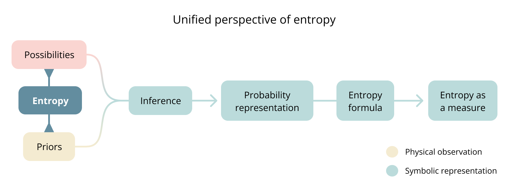
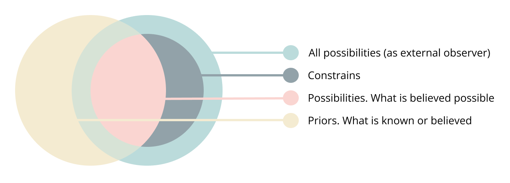
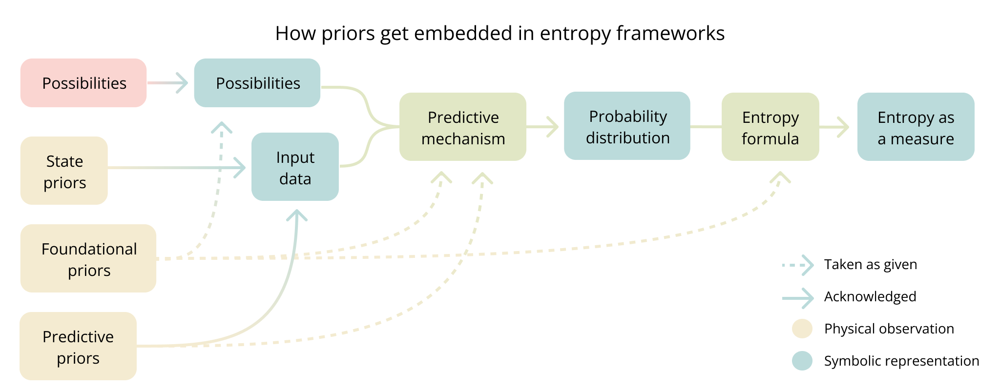

# A unified perspective of entropy

Entropy is a central concept across many fields, yet each defines it differently while trying to capture the same underlying idea. Because each discipline builds on its own assumptions, entropy often appears distinct across contexts, making its unifying principles less apparent.

[This _Quanta Magazine_ article](https://www.quantamagazine.org/what-is-entropy-a-measure-of-just-how-little-we-really-know-20241213/) offers a thoughtful perspective on the historical and conceptual challenges of entropy across different fields.

In this work, I explore how **entropy as a phenomenon can be unified across disciplines by defining it as the relationship between priors and possibilities**. While entropy as a measure varies depending on its formalization, the underlying structure remains consistent.

Probability, often treated as an self-evident. With this frameworks probability emerges from the same relationship.

## Entropy as phenomenon is distinct from entropy as a measure

Phenomena exist independently of representation. Mathematical expressions, language, visual models, and formal notations provide ways to describe them, but no symbolic representation can fully capture reality. A map is never the territory.

A mountain's height exists whether measured in feet or meter. Economic growth exists whether expressed as percentages or narrated in an article.

Measurement is a specific type of representation that quantifies phenomena. It transforms the phenomenon into numerical values enabling comparison and computation.

This distinction applies to entropy. Entropy exists as a phenomenon independently of any mathematical formulation used to measure it. While entropy as a measure is formally defined across disciplines, there is no single unified conceptual definition of the phenomenon itself.

The notions of uncertainty and disorder entropy represents suggest a fundamental unity, but its vagueness keeps the definition of the phenomenon obscured.




## What is entropy

Because **uncertainty is the unifying notion across all entropy** formulations, we can examine it to see what we can intuitively grasp from our direct experience.

Imagine you hear an unexpected sound. What defines the **uncertainty** you feel?
It is the relation between **what you know** and **any** of the **possibilities you believe** could have caused it. This is the phenomenon entropy represents.

> **Entropy as a phenomenon** is the relationship between **priors** and **any possibility**, relative to the entire space of **possibilities**.

Priors reflect "what is known" and possibilities reflect "what is believed possible"

## What is probability

If entropy reflects the ideas of uncertainty, and it can be understood as the relationship between priors and possibilities, what is probability?

Just like entropy, probability exists as a phenomenon before its measured and it is also a relationship between what is known and what is believed possible, they differ in the specificity.

[sound example]

> **Probability as a phenomenon** is the relationship between **priors** and a **specific possibility**, relative to the entire space of **possibilities**.


## Certainty vs uncertainty [go first]

While **entropy reflects uncertainty**, **probability reflects certainty**. Although we often think of certainty and uncertainty as opposites, they are not entirely so—the key difference is **specificity**.

- **Uncertainty** expresses knowledge relative to **any possibility**.
- **Certainty** expresses knowledge relative to **a specific possibility**.

Uncertainty extends over a range of possibilities, while certainty requires a specific possibility to be certain about. The former encompasses the state of knowledge across any option, and the latter is the state of knowledge over a specific one.

The positive association with certainty and the negative association with uncertainty are not fundamental properties but reflections of how knowledge interacts with specificity.

## What are priors

Priors are everything that informs inference or prediction. They represent the complete basis of information needed to infer.

We can refer to priors in many ways: knowledge, beliefs, conceptual frameworks, memories of experiences, rules, regularities, models, algorithms, or assumptions. Anything that shapes how we interpret information or make predictions is a prior.

"Available information" or "inputs" are often used to describe prior, but I specifically choose prior to reflect its fundamental role in inference. Priors are defined solely by their influence on inference outcomes, regardless of their information structure or the size of their influence. Any element that affects inference, no matter how subtly, is necessarily a prior.

Not acknowledging all priors leads to inaccurate representations and violates basic probability theory. This means that the framework itself, the predictive mechanism, and the formula used for entropy are informed by priors.

All priors ultimately emerge from physical observations, even the most abstract frameworks. Mathematical structures, causal assumptions, and conceptual categories all trace back to chains of physical observations, accumulated and refined through individual and collective experience.

- When finding the cause of an unexpected sound the priors will include sound itself,  experiences with similar sounds, knowledge of the environment, and ideas of potential sources. Fundamentally the internal model of reality of the specific context.

- Statistical mechanics recognizes macroscopic measurements like temperature, pressure, and volume as inputs for inference from which microstate probabilities are derived. Yet comprehensive priors must also include conservation laws, equal a priori probability, particle indistinguishability, interaction models, the ergodic hypothesis, boundary conditions, and the mathematical framework itself. All these elements influence how microstates are defined, counted, and assigned probabilities.
  
- Information theory recognizes observed symbol frequencies as inputs for inference from which symbol probabilities are derived. Yet comprehensive priors must also include the defined symbol set, independence assumptions between symbols, symbol probabilities remain consistent, discretization choices, message boundary definitions... All these elements influence how symbols are identified, counted, and assigned probabilities.

### The puzzling nature of comprehensive priors

It's impossible to exhaustively enumerate all priors as individual entities precisely because of their comprehensive nature. They span diverse information types—symbol sequences, mathematical frameworks, observations, beliefs—existing at different levels of abstraction and complexity.

The internal models of framework conceivers inevitably become foundational priors of particular probability and entropy formulations.

This complexity becomes even more challenging when priors must be represented symbolically, where the representational space is finite and somewhat discrete, forcing continuous and interconnected knowledge into fragmented symbolic forms.

Yet despite this puzzling nature, we cannot escape the requirement for comprehensiveness. For probability and entropy to be well defined, priors must include everything that affects inference, whether acknowledged or not.

## What are possibilities

Possibilities represent the scope of the inference. It is what is left after applying constraints over an otherwise infinite space of everything.

These constraint are not only necessary for meaningful inference but define the inference itself. Without constraints, the space would include everything conceivable, rendering inference impossible. The act of constraining defines what can be inferred about and establishes the purpose of inference itself.

The conceiver of the inference shapes these constraints reflecting what is considered meaningful to include or exclude .

Constraints operate across multiple dimensions simultaneously. They may limit time frames, physical or symbolic spaces, physical properties, causal relationships, conceptual categories, or logical conditions. The specific combination determines what remains in the possibility space.

A weather forecast, is the possibility space left after constrains excludes any phenomenon that is not about precipitation about a specific location at specific future time. It excludes all phenomena unrelated to this, is not about a die rolls or the outcome of symbolic sequence.

### Possibilities vs constrains

Possibilities and constrains are analogous. They are complementary and each other's negative space over everything.

```possibilities = everything + constrains```

Language naturally obscures the constraining process that defines possibilities. When we name something like a "coin flip" or "weather forecast, we implicitly exclude everything unrelated without acknowledging this exclusion. Names create the illusion of being self-evident objects but they are also the negative space over everything else

Probability theory institutionalizes this blindspot by defining "possible outcomes" as elements of a sample space (possibilities) without examining how this space is determined. When writing P(x), we've already constrained the universe to specific outcomes. The sample space is presented as self-evident, as if it simply exists rather than being actively constructed.

This explains why possibilities are not traditionally defined as such and take different names across entropy frameworks:

- In information theory, they are "outcomes," representing symbol sequences while excluding all physical objects and non-symbolic entities
- In statistical mechanics, they are "microstates," describing particle configurations with arrangements satisfying conservation laws and boundary conditions.
- In causal inference, such as identifying a sound's origin, they are "potential causes", encompassing only phenomena capable of generating the specific sound in the specific environment.

These spaces operate in entirely different domains with different rules. Yet defining possibilities as constrained spaces provides a higher generalization revealing the relationship with priors, probabilities, and entropy across all domains.

I use possibilities and constrains interchangeably based on context.

## What is inference

If priors are everything that informs inference, and possibilities define its purpose and scope. Inference is deterministically defined by them.

This definition is extensible to any form of computation. I use inference instead of computation because its more expressive at acknowledging the fundamental role of priors but the same framework can be apply to calculus, logical reasoning, prediction or symbolic computation. What distinguishes them are the constrains.

In a calculation using arithmetics the constrains space for only unique numeric outputs further constrained by very specific rules.
Prediction is a type of inference where the possibility space is constrained to a future time.
Reasoning is inference where the problem being solve are the constrains and the internal model are the priors.
### Inference reflects only constrains recognized by priors

Possibilities are defined externally because they inherently establish the constrained space in which inference operates. Since inference cannot occur over an undefined space, the conceiver imposes constraints that shape its scope before inference begins.

Yet, possibilities affect inference only insofar as priors can recognize and account for their constraints. It depends not on the full range of actual possibilities but on what priors acknowledge as possible. This is the "believed" part in the definition of possibilities as "what is believed possible".



Consider a die. Whether it has five, six, or seven sides, if priors assume a fair six-sided die, the probability or entropy about the outcomes remains unchanged. The unrecognized sides do not affect the calculation.

What might seem like the "actual possibilities" is an outside perspective, they are our own priors as external observers, not the priors of the inference studied. Expanding the possibility space from an outside perspective does not change inference unless priors can recognize them.

You hear a sound. Many things could have caused it. But your priors only consider what you believe possible. If the actual cause is something that is not recognized  it will not affect the uncertainty or certainty about a conceived possibility.

### Inference can't be separated from priors and possibilities

Inference is not neutral and doesn't exist as standalone process. It is itself a prior, imposing structure on how priors and possibilities relate. The choice of inference method determines how information is extracted, which constraints are applied, and what form the probability representation takes.

The way we infer is inseparable from what we know; different knowledge structures create different inference patterns.

Traditional views adopt a Cartesian separation between computation and data, treating processes and inputs as distinct entities. In a symbolic computation this separation exists structurally, yet priors are not analogous to pure data, and inference is more than just processing.

Computation cannot be fundamentally defined without a symbolic representation like Turing machines or lambda calculus. In any such representation, their structure, formulation, and algorithm emerge from priors. The separation between inference and priors is apparent, not fundamental.

Inference is both an expression of priors and a constraint on the space of possibilities. While symbolic representations may suggest an apparent separation, as a phenomenon, inference is inseparable from priors and possibilities.

## From phenomenon to measure

The quantification of probability and entropy as measures requires inference, which imposes symbolic and numerical constraints to make these concepts computable. This process structures priors and possibilities into a form that allows them to be represented mathematically.

Inference can bridge the non-symbolic and symbolic spaces. For clarity it can be decomposed into distinct aspects:

1. **Mental reasoning:** The conceptual framing of the problem.
	- Involves both the conceiver of the framework and the user applying it.
	- Uses mental models and specific observations (e.g., macrostates in thermodynamics, symbol sequences in information theory) to define the possibility space and select relevant priors.
	- Establishes what is considered relevant for inference before any symbolic formalization.

2. **Symbolic conversion**: Encoding priors and possibilities into a structured symbolic form.
	- Encodes priors and possibilities into a structured, processable form based on the priors of both the conceiver and the user.
	- **Possibilities** can be expressed as enumerations, rules, natural language descriptions, mathematical constraints, symbolic spaces, or algorithms.
	- **Priors** can be formalized as mathematical models, machine learning models, heuristic rules, conceptual frameworks, probability distributions, linguistic descriptions, or databases.
	- This step ensures that inference can operate within a symbolic framework, allowing probability representations to emerge.

3. **Arithmetic calculation**: Applying probability formulas to compute probabilities and entropy.
	- Uses a formal probability representation to compute either:
	    - A probability measure for a specific possibility.
	    - Entropy as a measure, summarizing the structure of the probability distribution.

Since non-symbolic priors influence every stage, by our definition this inference should be treated as a single process rather than independent steps. The apparent modularity arises from how priors and possibilities are progressively refined and formalized.

These three steps will exist for any inference quantity that requires to be expressed in numerical form, such as probability and entropy as measures.

In a die roll, mental reasoning establishes that the die has six faces and no predictable outcome, leading to the assumption of equal probability. Symbolic conversion formalizes this by defining the possibility space {1,2,3,4,5,6} and a uniform probability distribution. Arithmetic calculation then computes entropy.
### Die Roll

- **Priors**: Everything known about a die, including that it has **six faces**, that it is a cube, and that past experience suggests it is **unpredictable** which face it will land on.
- **Possibilities**: The **six faces** the die can land on, **excluding** outcomes like landing on an edge.
- **Inference**: Mental reasoning based on priors and possibilities, leading to the conclusion that each face is equally likely. 
- **Probability Measure**: The result of inference expressed in **symbolic form**, assigning equal probability to each face: ``` P(X = x_i) = 1/6, for i ∈ {1,2,3,4,5,6}```
- **Entropy as a Measure**: A calculation derived from the probability representation, quantifying the uncertainty in bits:
```
H(X) = - ∑ P(X = x_i) log_2 P(X = x_i)
     = - ∑ (1/6) log_2 (1/6)
     = log_2 6
```

## Probability as measure encodes possibilities and priors

A probability representation is the structures that encode the relationship between priors and specific possibilities in numerical form.

It fuses priors and a possibility into a single inseparable expression. Writing **P(x)** already integrates what we assume (priors) with what we consider possible (possibilities). In a coin flip, **P(heads) = 0.5** embeds both prior knowledge (coin physics, fairness) and the assumed possibility space ( only heads, no tails or other outcomes).

Whether probability is **discrete, continuous, uniform, joint, conditional, marginal, or single-valued** they all encodes the same underlying relationship and they differ in the scope of the possibility space.

The same relationship between priors and possibilities of the phenomenon of a coin flip can be represented in different probability forms.

- **Continuous distribution** over the coin’s angle (PDF).
- **Equal probability** (1/2) for each outcome (Uniform measure).
- **A single outcome** (heads or tails only, single-value probability).
- ...

The particular choice of the probability representation is both a constraint on what can be expressed in possibility space and a prior shaping how they relate.

Once formalized, probability merges priors and possibilities into a single structure, making their distinct roles indistinguishable. It hides their natural separation.

## Entropy as a measure

Entropy as a measure depends on the choice of probability representation and the specific entropy formula used. Different representations define what aspects of possibilities and priors are captured, constraining what entropy quantifies.

Surprisal (self-information) is not fundamentally different from other entropy formulations. It corresponds to entropy over a probability distribution constrained to a single possibility. It follows the same structural relationship between priors and possibilities but at the most localized level.ty.

## How priors get obscurely embedded in entropy frameworks

Classic entropy frameworks embed priors without acknowledging them. This leads to incomplete representations of what entropy actually measures. The following a more detailed analysis to illustrate how priors inform every layer of entropy formalization.

### The necessity of comprehensive priors

A probability distribution cannot be well-defined unless priors include everything that affects it. Any external influence would make the distribution non-deterministic, violating basic probability theory. Therefore, priors must be comprehensive by definition.

Missing or unacknowledged priors lead to incomplete probability representations. If an element influences inference, it is a prior—whether recognized or not.

Classic frameworks acknowledge only state data as priors, failing to recognize that their formulations, assumptions, and inference methods are also priors. This incomplete recognition obscures what entropy actually measures.

### Types of priors and how they shape entropy frameworks

I believe the following categorization or priors can help to see how they get embedded in classic entropy frameworks.

- **State priors** are explicitly recognized inputs that frameworks acknowledge. They provide the specific data that, when processed through inference mechanisms, produce probability distributions.
 These would be microscopic arrangements in thermodynamics, symbol frequencies in information theory.

- **Foundational priors** define the conceptual space, even before formalization. They emerge from our internal models of reality and meaning and therefore and constrained by what is consider conceivable. They dictate what elements constitute the system and how these elements relate. They determine how physical observations transform into formal elements, define what is considered possible, measurable, or significant. Most foundational priors remain invisible as they reflect the conceiver's deep assumptions about reality. Any formalization of entropy as a measure is relative to these foundational priors, reflecting specific assumptions chosen by its conceivers.
 Scientific theories, mathematical formalisms, and analytical frameworks are all foundational priors. Statistical mechanics builds on assumptions that particles follow deterministic laws, accessible microstates have equal probability, and energy remains conserved within closed systems. Information theory rests on ideas such as the assumption that messages have finite length and symbols follow statistical patterns.

- **Predictive priors** are observed regularities about how reality behaves. They shape inference mechanisms by determining how probabilities are assigned to possibilities.
 In statistical mechanics, predictive priors about conservation laws and particle independence become the mathematical apparatus for assigning probabilities to microstates. In information theory, observed regularities in communication become the basis for predicting symbol likelihoods.



### Symbolic representation embeds priors

A symbolic representation always reduces a phenomenon based on what's deemed significant. What is included or excluded reflects foundational assumptions. Mathematical formalism necessarily embeds these assumptions.

Since symbolic representations are built on priors, they do not fundamentally define reality but instead reflect what is considered meaningful within a given framework.

### Priors and possibilities are constrained by foundational priors

Since the frameworks themselves emerge from foundational priors, priors define both, its structure and its representation. This creates two types of constraints:

- Framework design limits what is conceivable within the system
- Symbolic representation limits what can be expressed in its language

The act of formalizing a system in symbolic form determines what priors and possibilities can exist within it. Each framework's scope is bounded by what its structure can conceive and its language can express. This artificially constrains both possibilities and priors. Anything that cannot be conceptualized or represented in the framework's language is automatically excluded.

Information theory can only conceive and express symbol sequences and their patterns. Statistical mechanics can only represent mathematical descriptions of physical states and their behaviors.

How a framework is conceptualized fundamentally constrains what it can measure.

### Entropy is not absolute and depends on priors, not observers

Statistical mechanics treats entropy as an absolute property of the system, defining it in terms of microstates. It presents entropy as an inherent property, independent of observation or knowledge.

What counts as a microstate, however, depends on assumptions about constraints, interactions, and statistical treatment. The number of microstates is not purely objective but shaped by how the system is modeled, which variables are considered, and how probabilities are assigned.

What statistical mechanics treats as absolute is actually based on specific priors being taken as universal. The same physical system can have different entropy values under different priors, even if its underlying states remain unchanged.

Information theory recognizes entropy as relative, but attributes this to observers rather than priors. This observer-dependence is only partially correct. Entropy depends on priors, An observer is simply an embodiment of them, but priors could be conceived to exist independently of any specific observer.

Furthermore, information theory does not recognize that the method used to calculate the probability distribution or the entropy formula are themselves products of predictive and system priors. The framework dictates how probabilities are assigned independently of the observer knowledge.

## Entropy as a measure can't be unified

Entropy as a measure requires formalizing the relationship between priors and possibilities. Since there is no neutral or absolute way to define them symbolically, entropy as a measure cannot be unified.

There is no unified definition of distance as a measure. It can be expressed in meters, feet, or travel time. Each formalization of entropy as a measure is shape by its foundational priors and captures aspects relevant to its domain while necessarily excluding.