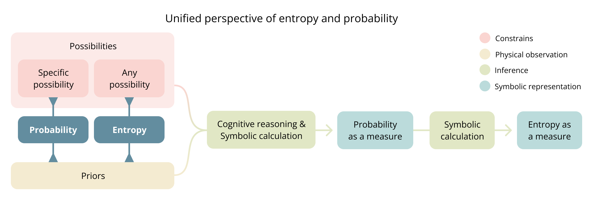

- [A unified perspective of entropy and probability](#a-unified-perspective-of-entropy-and-probability)
    - [Phenomenon and measure are distinct](#phenomenon-and-measure-are-distinct)
    - [Phenomena](#phenomena)
        - [Entropy and probability as phenomena](#entropy-and-probability-as-phenomena)
        - [Mapping to Intuitive Understanding](#mapping-to-intuitive-understanding)
        - [What are priors](#what-are-priors)
        - [What are possibilities](#what-are-possibilities)
            - [Possibilities vs constrains](#possibilities-vs-constrains)
            - [Specificity as constraint](#specificity-as-constraint)
            - [Only constrains recognized by priors have an effect](#only-constrains-recognized-by-priors-have-an-effect)
        - [What is inference](#what-is-inference)
            - [Inference types as constraints](#inference-types-as-constraints)
            - [The inference process can't be separated from priors or possibilities](#the-inference-process-cant-be-separated-from-priors-or-possibilities)
    - [Measures](#measures)
        - [From Phenomenon to Measure](#from-phenomenon-to-measure)
        - [Priors and possibilities are constrained by foundational priors](#priors-and-possibilities-are-constrained-by-foundational-priors)
        - [Probability as measure encodes possibilities and priors](#probability-as-measure-encodes-possibilities-and-priors)
        - [Entropy as a Measure](#entropy-as-a-measure)
        - [Entropy as a measure can't be unified](#entropy-as-a-measure-cant-be-unified)
    - [Revisiting classic entropy frameworks](#revisiting-classic-entropy-frameworks)
        - [A priors taxonomy](#a-priors-taxonomy)
        - [Entropy in statistical mechanics](#entropy-in-statistical-mechanics)
            - [Entropy and the second law of thermodynamics](#entropy-and-the-second-law-of-thermodynamics)
            - [A simpler resolution of the Gibbs paradox](#a-simpler-resolution-of-the-gibbs-paradox)
        - [Entropy in information theory](#entropy-in-information-theory)
            - [Entropy is not relative to the observer](#entropy-is-not-relative-to-the-observer)
    - [Conclusion](#conclusion)
    - [Notes](#notes)


# A unified perspective of entropy and probability

Entropy is a central concept across many fields, yet each defines it differently while trying to capture the same underlying idea. Because each discipline builds on its own assumptions, entropy often appears distinct across contexts, making its unifying principles less apparent.

This [Quanta Magazine article](https://www.quantamagazine.org/what-is-entropy-a-measure-of-just-how-little-we-really-know-20241213/) provides an overview of how different scientific disciplines have historically developed their own definitions of entropy, highlighting the conceptual challenges that have led to these divergent paths.

In this work, I introduce a conceptual framework that unifies entropy and probability as phenomena and unifies statistical mechanics and information measures of entropy under the same conceptual framework, rather than treating them as merely analogous.

- Entropy and probability exist as phenomena prior to measurement. They represent relationships that exist in reality independent of our attempts to quantify them.
- Entropy and probability represent the relationship between priors and possibilities. They differ only in specificity of the relationship. Probability concerns a specific possibility, and entropy concerns any possibility within the possibility space.
- Possibilities emerge from constraints imposed on an otherwise unrestricted reality.
- Priors include not only observed data but also fundamental assumptions embedded in a framework. Shaping what probability and entropy measure

This conceptualization questions traditional interpretations of the roles of entropy:

- Statistical mechanics entropy is revealed as a quality of what is known about a system, rather than an inherent physical property.
- The increase of entropy over time in thermodynamic systems is a misrepresentation of the second law of thermodynamics, as this is only the case for a particular modeling approach using specific priors.
- The Gibbs paradox is resolved by recognizing indistinguishability as a prior assumption about how states are counted.
- Entropy is not merely observer-dependent as information theory suggests, but is shaped by how the frameworks themselves includes foundational assumptions.

## Phenomenon and measure are distinct

Phenomena exist independently of representation. Mathematical expressions, language, visual models, and formal notations provide ways to describe them, but no symbolic representation can fully capture reality. A map is never the territory.

A mountain's height exists whether measured in feet or meter. Economic growth exists whether expressed as percentages or narrated in an article.

Measurement is a specific type of representation that quantifies phenomena. It transforms the phenomenon into numerical values enabling comparison and computation.

This distinction applies to probability and entropy. They exists as a phenomenon independently of any mathematical formulation used to measure it.

## Phenomena

Before examining entropy and probability as measures, we first need to understand the phenomena they represent. This section outlines their fundamental nature, followed by definitions of priors and possibilities as their primary components. I will also re conceptualize the idea of inference, as it plays a key role in how measurement emerges.

### Entropy and probability as phenomena

Entropy and probability exist as phenomena before they are formalized into measures. Both represent fundamental relationships between what is known (priors) and what is believed possible (possibilities), differing only in their specificity.

> **Entropy as a phenomenon** is the relationship between **priors** and **any possibility**, relative to the entire space of **possibilities**.

> **Probability as a phenomenon** is the relationship between **priors** and a **specific possibility**, relative to the entire space of **possibilities**.

These relationships exist independently of how we choose to measure or formalize them.



### Mapping to Intuitive Understanding

The notions of certainty and uncertainty provide an intuitive foundation for understanding entropy and probability.

These concepts should not be dismissed as mere informal approximations of more rigorous mathematical definitions. While intuition may be ambiguous, it precedes formalization. Mathematical models are ultimately attempts to capture recurrent patterns in human experience.

The fact that “uncertainty” underlies various interpretations of entropy across disciplines is not a coincidence but a reflection of a fundamental pattern that different fields express in their own ways.

By grounding the notions of "certainty" and "uncertainty" into our direct experience, we can have a more intuitive understanding of "probability" and "entropy," their formal analogs.

Imagine you hear an unexpected sound. What defines the uncertainty you feel? It is the relation between what you know and any of the possibilities you believe could have caused it. This intuitive experience reflects the same phenomenon that entropy formalizes across disciplines.

Arguably, probability reflects the idea of certainty. It quantifies knowledge about a specific possibility. While used categorically, certainty and uncertainty are perceived as opposites.  But if they are treated as quantities representing a degree of knowledge, certainty and uncertainty differ primarily in the specificity of the space of possibilities they refer to. Uncertainty spans multiple possibilities, capturing the extent of what is unknown across options. Certainty requires a specific possibility to be certain about.

### What are priors

Priors are the total state of knowledge or belief that exists and informs probability, entropy or inference.

We can refer to priors in many ways: knowledge, beliefs, conceptual frameworks, memories of experiences, rules, regularities, models, algorithms, or assumptions. Anything that shapes how we interpret information or make predictions is a prior.

"Available information" or "inputs" are often used to describe prior, but I specifically choose prior to reflect its fundamental role in informing. This is particular clear in inference. Priors are defined solely by their influence on inference outcomes, regardless of their information structure or the size of their influence. Any element that affects inference, no matter how subtly, is necessarily a prior.

Not acknowledging all priors leads to inaccurate representations and violates basic probability theory. This means that the framework itself, the predictive mechanism, and the formula used for entropy are informed by priors.

All priors ultimately emerge from physical observations, even the most abstract frameworks. Mathematical models, causal assumptions, and conceptual categories all trace back to chains of physical observations, accumulated and refined through individual and collective experience.

- When finding the cause of an unexpected sound the priors will include sound itself,  experiences with similar sounds, knowledge of the environment, and ideas of potential sources. Fundamentally the internal model of reality of the specific context.
- Statistical mechanics recognizes macroscopic measurements like temperature, pressure, and volume as inputs for inference from which microstate probabilities are derived. Yet comprehensive priors must also include conservation laws, equal a priori probability, particle indistinguishability, interaction models, the ergodic hypothesis, boundary conditions, and the mathematical framework itself. All these elements influence how microstates are defined, counted, and assigned probabilities.
- Information theory recognizes observed symbol frequencies as inputs for inference from which symbol probabilities are derived. Yet comprehensive priors must also include the defined symbol set, independence assumptions between symbols, symbol probabilities remain consistent, discretization choices, message boundary definitions...

It's impossible to exhaustively enumerate all priors as individual entities precisely because of their comprehensive nature. They span diverse information types—symbol sequences, mathematical frameworks, observations, beliefs—existing at different levels of abstraction and complexity.

Yet despite this puzzling nature, we cannot escape the requirement for comprehensiveness. **For probability and entropy to be well defined, priors must include everything that affects them**.

### What are possibilities

Probability, entropy or inference can only exist over a scope of interest. There must be something, a possibility space to be certain, uncertain or to infer about. It can't be everything.

Possibilities is what is left after applying constraints over an otherwise infinite space of everything.

Constraints operate across multiple dimensions simultaneously. They may limit time frames, physical or symbolic spaces, physical properties, causal relationships, conceptual categories, or logical conditions. The specific combination determines what remains in the possibility space.

A rain forecast, is the possibility space left after constrains excludes any phenomenon that is not about precipitation about a specific location at specific future time. It excludes all phenomena unrelated to this, is not about a die rolls or the outcome of symbolic sequence.

#### Possibilities vs constrains

Possibilities and constrains are complementary and each other's negative space over everything.

```possibilites = everything + constrains```

Language naturally obscures the constraining process that defines possibilities. When we name something like a "coin flip" or "weather forecast, we implicitly exclude everything unrelated without acknowledging this exclusion. Names create the illusion of being self-evident objects but they are also the negative space over everything else.

Probability theory institutionalizes this blindspot by defining "possible outcomes" as elements of a sample space (possibilities) without examining how this space is determined. When writing P(x), we've already constrained the universe to specific outcomes. The sample space is presented as self-evident, as if it simply exists rather than being actively constructed.

This explains why possibilities are not traditionally defined as such and take different names across entropy frameworks. Defining them as constrained spaces creates a commonality among them

- In information theory, they are "outcomes," representing symbol sequences while excluding all physical objects and non-symbolic entities
- In statistical mechanics, they are "microstates," describing particle configurations with arrangements satisfying conservation laws and boundary conditions.
- In causal inference, such as identifying a sound's origin, they are "potential causes", encompassing only phenomena capable of generating the specific sound in the specific environment.

I use possibilities and constrains interchangeably based on context.

#### Specificity as constraint

Entropy and probability represent the same relationship between priors and possibilities, differentiated only by the specificity of the relationship between possibilities.

The specificity itself is a constraint that defines how a possibility relates to the entire space of possibilities. As single possibility for probability and as any possibility for entropy.

The fact that entropy as a measure can be derived from a probability distribution reflects how its relationship with the entire space of possibilities is less specific.

#### Only constrains recognized by priors have an effect

Possibilities affect entropy or probability only insofar as priors can recognize and account for their constraints. Their value depends not on the full range of possibilities but on what priors can acknowledge as possible.

In a way possibilities are a subspace of priors. This is the "believed" part in the informal definition of possibilities as "what is believed possible".


Consider a die. Whether it has five, six, or seven sides, if priors assume a fair six-sided die, the probability or entropy about the outcomes remains unchanged. The unrecognized sides do not affect the calculation.

What might seem like the "actual possibilities" is an outside perspective, they are our own priors as external observers, not the priors of the inference studied. Expanding the possibility space from an outside perspective does not change inference unless priors can recognize them.

You hear a sound. Many things could have caused it. But your priors only consider what you believe possible. If the actual cause is something that is not recognized  it will not affect the uncertainty or certainty about a conceived possibility.

### What is inference

To go from a phenomenon to a measurable quantity a transformation is necessary. This transformation can be understood as process of inference under the same conceptual framework of priors and possibilities.

Inference takes many forms, but all involve deriving an outcome by applying a set of rules or principles to available information. This means that a particular inference is defined exclusively by priors (available information) and constrains (rules or principles).

While priors and possibilities exist independently of inference, inference cannot exist without them.

Inference is the process that reveals how priors relate under certain constraints. It transforms the implicit relationship into explicit outcomes.

For inference to be deterministic nothing but priors and constrains can define it. If something influences it, must be considered a prior. This includes the  inference mechanism is itself.

#### Inference types as constraints

Constraints define the type of inference. They establish its purpose, rules and scope. Without constraints, the problem space would include everything conceivable, rendering inference impossible.

They define the form of the outcome as well as what particular mechanisms or rules can be used to infer fundamentally defining the paradigm within which inference operates. These may include:

- **Representational**: Constraint how the outcome is expressed. Includes natural language, analog outputs and symbolic or numeric representations. The later are particularly significant. They form the foundation for most computational and mathematical inference methods, including arithmetics, or any type of symbolic computation like algorithms or machine learning.
- **Relational**: Constraint how priors relate. They enforce causal and associative relations, dependencies or logical and heuristic rules like axioms in reasoning or math.
- **Resource based**: Constraint what is accessible or possible by limiting resources of the medium used for inference like time, memory or power.
- **Contextual**: Constrains defining the particular problem scope or time frame.

Modeling inference as constraints applied over priors is an extremely powerful construct because unifies all forms of computation under the same basis, including symbolic and non symbolic forms. I use inference instead of computation because its more expressive at acknowledging the fundamental role of priors as being comprehensive.

Prediction is inference constraining the outcome to a future time. Particular types of reasoning are constrained by logical rules like deduction, induction, first principles or causation.  Arithmetics are constrained by mathematical axioms and numeric representation.

#### The inference process can't be separated from priors or possibilities

Inference is not neutral and doesn't exist as standalone process because it cannot be separated from its dependency on priors nor possibilities.  When inference is formalized, we embed assumptions about what constitutes valid reasoning. The inference mechanism determines how information is interpreted and constraints are applied. It is itself a prior. The way we infer is inseparable from what we know; different knowledge create different inference patterns.

Traditional views adopt a Cartesian separation between computation and data, treating processes and inputs as distinct entities. In a symbolic computation this separation exists structurally, yet priors are not analogous to pure data, and inference is more than just processing.

Computation cannot be fundamentally defined without a symbolic representation like Turing machines or lambda calculus. In any such representation, their structure, formulation, and algorithm emerge from priors. The separation between the inference process and priors is apparent, not fundamental.

Inference is both an expression of priors and a constraint on the space of possibilities. While traditiona conceptualizations of inference may suggest an apparent separation, as a phenomenon, inference is inseparable from priors and possibilities.

## Measures

A symbolic representation requires an entity to observe a phenomenon, conceptualize it, and express it symbolically. Perception, interpretation, and prior knowledge shape this process, intrinsically binding the representation to the entity’s priors.

Any symbolic representation, by definition being an abstraction, always reduces a phenomenon to what is deemed significant. What is included or excluded reflects foundational assumptions. It is never neutral. The representation process is inseparable from our internal models. They do not define reality but instead reflect what is considered meaningful within a given framework.

Entropy and probability, more than any other concepts, exist at the boundary between physical reality and symbolic representation. Because they conceptualize the state of knowledge the embedding of priors in their measurable forms cannot be ignored.

### From Phenomenon to Measure

A quantity is an outcome of inference where priors, including conceptual models and observations of the phenomenon, are transformed into particular numeric forms. This transformation follows rules that constrain the outcome. This process applies to quantifying both entropy and probability.

The inference to produce a measure can be conceptualized into two stages:

1. **Cognitive reasoning:** Observations and mental models (priors) conceptualize and reason about the observed phenomenon in a way that can be represented symbolically (constraints).
 - **Possibilities** can be expressed as enumerations, rules, natural language descriptions, mathematical constraints, symbolic spaces, or algorithms.
 - **Priors** can be formalized as mathematical models, machine learning models, heuristic rules, conceptual frameworks, probability distributions, linguistic descriptions, or databases.

2. **Symbolic calculation**: Symbols and numbers are represented and computed using math and algorithms to produce the final numeric quantity.

These stages cannot be fully separated. Both are influenced by the priors of their conceivers. The aspects of phenomena deemed significant are determined by the observer's particular observations and mental models. Similarly, the frameworks, formulas, and algorithms used in symbolic calculation inevitably reflect their creators' internal models and assumptions.

Whether a calculation occurs mentally with only the outcome expressed symbolically, or through extensive symbolic calculation, both processes remain coupled to the priors of its conceiver.

In a die roll, cognitive reasoning establishes a six-faced object with unpredictable outcomes, leading to a uniform probability representation {1,2,3,4,5,6}. The choice of entropy formula used to calculate uncertainty is itself part of this reasoning process.

### Priors and possibilities are constrained by foundational priors

Foundational priors  are priors that emerge from our internal models of reality and meaning, they represent our deepest beliefs about how the world works.

Since the frameworks themselves emerge from foundational priors, priors define both, its structure and its representation. This creates two types of constraints:

- Framework design limits what is conceivable within the system being modeled.
- Symbolic representation limits what can be expressed in its language.

The act of formalizing a system in symbolic form determines what priors and possibilities can exist within it. Each framework's scope is bounded by what its structure can conceive and its language can express. This artificially constrains both possibilities and priors. Anything that cannot be conceptualized or represented in the framework's language is automatically excluded.

Information theory can only conceive and express symbol sequences and their patterns. Statistical mechanics can only represent mathematical descriptions of physical states and their behaviors. How a framework is conceptualized fundamentally constrains what it can measure.

### Probability as measure encodes possibilities and priors

A probability representation is a very special outcome of inference. It encodes the relationship between priors and specific possibilities in numerical form.

It fuses priors and a possibility into a single inseparable expression. Writing **P(x)** already integrates what we assume (priors) with what we consider possible (possibilities). In a coin flip, **P(heads) = 0.5** embeds both prior knowledge (coin physics, fairness) and the assumed possibility space (only heads, no tails or other outcomes).

Whether probability is **discrete, continuous, uniform, joint, conditional, marginal, or single-valued** they all encodes the same underlying relationship and they differ in the scope or constrains of the possibility space.

The same relationship between priors and possibilities of the phenomenon of a coin flip can be represented in different probability forms.

- **Continuous distribution** over the coin’s angle (PDF).
- **Equal probability** (1/2) for each outcome (Uniform measure).
- **A single outcome** (heads or tails only, single-value probability).
- ...

The particular choice of the probability representation is both a constraint on what can be expressed in possibility space and a prior shaping how they relate.

Once formalized, probability merges priors and possibilities into a single structure, making their distinct roles indistinguishable.

### Entropy as a Measure

Entropy as a measure is also the product of inference. It shares the main constraints and priors as probability, differing primarily in the specificity constraint (addressing any possibility rather than a specific one) and with additional normalization constraints that determine its final quantitative form. This relationship allows entropy to be derived directly from any probability representation.

These normalization constraints create the apparent differences between entropy formulas across domains. Thermodynamic entropy includes Boltzmann's constant (k_B) and uses natural logarithms, while information-theoretic entropy typically uses logarithm base 2 to measure in bits. These choices aren't fundamental differences in what entropy represents, but reflect specific framework needs.

This framework highlights that any form of probability distribution - whether discrete, continuous, joint, conditional, or multivariate - can validly represent entropy. Each representation captures the same fundamental relationship between priors and possibilities, just through different constraints appropriate to its domain.

Surprisal (self-information) is not fundamentally different from other entropy formulations. It corresponds to entropy over a probability distribution constrained to a single possibility, following the same structural relationship between priors and possibilities but at the most localized level.

The specific entropy formula used is therefore determined by both the chosen probability representation and the normalization constraints applied to express the final quantity in a particular form or unit.

### Entropy as a measure can't be unified

Entropy as a measure requires formalizing the relationship between priors and possibilities. Since there is no neutral or absolute way to define them symbolically, entropy as a measure cannot be unified.

There is no unified definition of distance as a measure. It can be expressed in meters, feet, or travel time. Each formalization of entropy as a measure is shape by its foundational priors and captures aspects relevant to its domain while necessarily excluding others.

## Revisiting classic entropy frameworks

Despite entropy as a measure remaining distinct across classic entropy formulations they are all representations of the same underlying phenomenon. They appear distinct due to the elusive nature of priors and possibilities. This following analysis reveals how priors, often unacknowledged, are obscurely embedded in these frameworks.

This perspective also challenges traditional views that conceive entropy as inherent property of physical systems or purely dependent on observers and it offers a reinterpretation of the second law of thermodynamics and a simpler resolution to the Gibbs paradox.

### A priors taxonomy

The following categorization or priors can aid in showing how they get embedded in classic entropy frameworks and will be used in the more specific analysis below.

- **State priors** are the explicitly recognized observations that the symbolic inputs of the frameworks acknowledge. They are the source of the specific data that, when processed through inference mechanisms, produce probability distributions.

- **Foundational priors** define the conceptual space, even before formalization. They emerge from our internal models of reality and meaning and therefore are constrained by what is consider conceivable. They dictate what elements constitute the system and how these elements relate. They determine how physical observations transform into formal elements, define what is considered possible, measurable, or significant. Most foundational priors remain invisible as they reflect the conceiver's deep assumptions about reality. Scientific theories, mathematical formalisms, and analytical frameworks are all foundational priors.

- **Predictive priors** are observed regularities about how reality behaves, often represented as physical laws or principles. They shape inference mechanisms by determining how probabilities are assigned to possibilities.


### Entropy in statistical mechanics

Statistical mechanics presents entropy as a quality of physical systems, but this framework reveals it as the relationship between possibilities and priors that statistical mechanics defines. It is one specific instantiation of a more general concept.

Different frameworks with different priors or constraints would yield different entropy measures for the same physical system.

- **Possibility space** is defined by specific constraints that determine valid microstates and system boundaries. Conservation laws limit accessible states to those satisfying energy, momentum, and particle number requirements. Boundary conditions restrict which particle arrangements are considered part of the system. Quantification constrains the framework's operation and outcomes to numerical forms.
- **State priors** are the macroscopic measurements like temperature, pressure, and volume.
- **Foundational priors** include basic conceptual frameworks for understanding reality. These distinguish between microscopic and macroscopic states, model physical systems as collections of components with quantifiable properties, and represent systems in phase space.
- **Predictive priors** include the equal a priori probability assumption, conservation laws, the ergodic hypothesis, and Liouville's theorem.

#### Entropy and the second law of thermodynamics

The second law of thermodynamics states that entropy increases in isolated systems.

This remains true only under the specific priors and possibility space that statistical mechanics defines. Entropy increases because predictive priors like equal a priori probability, conservation laws, and ergodicity [generate dynamics that spread probability across available phase space over time.

This is not an argument against the second law but a about what entropy represents. Thermodynamics portrays entropy behavior as an absolute and standalone physical phenomena. It is not. Given different priors, such as complete knowledge of individual particle trajectories, entropy could take on different values and exhibit different behavior for the same physical system.

#### A simpler resolution of the Gibbs paradox

The Gibbs paradox illustrates how entropy depends on priors. Classical statistical mechanics predicts an entropy increase when identical gases mix, but if the particles are recognized as indistinguishable, no entropy change occurs.

This discontinuity arises from a shift in how microstates are defined based on priors. When particles are treated as distinguishable, permutations count as distinct microstates. When they are treated as indistinguishable, these permutations are not counted separately, reducing the entropy.

The standard resolution attributes this to quantum indistinguishability as a physical fact. Our framework presents a different perspective: indistinguishability is not an inherent property of nature but a prior about how states are counted. Both treatments reflect valid prior choices that lead to different entropy values.

The physical system remains unchanged. Only the priors change.

### Entropy in information theory

Information theory's entropy is a more generic and refined version than statistical mechanics's. There are less foundational and predictive priors taken as given.

- **Possibility space** define the "outcomes". Is defined by being constrained in the symbolic space, by a specific choice of a discrete set of symbols. This set could be binary digits, letters in an alphabet, or abstract states.
- **State priors** are the same as the predictive priors, as the input are the probability distribution itself.
- **Foundational priors**, just like statistical mechanics include basic conceptual frameworks for understanding reality and how phenomena can be encoded into discrete symbols and how they are representative of the physical phenomena.
- **Predictive priors** are the observations that inform about event regularities or symbol sequences patterns.

#### Entropy is not relative to the observer

Information theory recognizes entropy as being relative to the state of knowledge, but attributes this to observers rather than priors. This observer-dependence is only partially correct as the observer is a only a partial embodiment of priors, as some are embedded in the framework itself. The idea of observer is not comprehensive of the fact that the inference methods used to calculate probability distributions and entropy measures are shaped by predictive and foundational priors.  

If we were to conceive the observer as the single entity embodying all priors then we will have to attribute to it all the foundational and predictive priors that conceive the information theory as a framework and its formulations.

## Conclusion

Probability and entropy exist wherever knowledge is embodied. They serve as essential tools for reconciling subjective experience with physical reality. Through inference, they bridge the gap between reality and its symbolic representation.

While entropy and probability uniquely quantify the state of knowledge, priors and constraints shape all forms of measurement—including perception, interpretation as well as its representation, including non numerical forms such as natural language.

It is well established that measurement is never neutral. However, the framework of priors and possibilities provides a more nuanced perspective, extending beyond the observer-dependent view. It reveals the specific mechanisms through which our knowledge frameworks shape what we measure, offering both insight and humility about the limits of what we can know and express about reality.

---

## Notes

- I consider this a living document that will require further refinement and corrections.
- These ideas emerge from a philosophical or epistemological approach. I have limited formal knowledge of statistical mechanics, information theory, or probability theory. The specifics conclusions in regards to these domains emerge from long discussion using LLMs and Wikipedia articles. I'll appreciate any correction in this regard.
- This article is available on GitHub to facilitate deeper discussion through GitHub issues.
